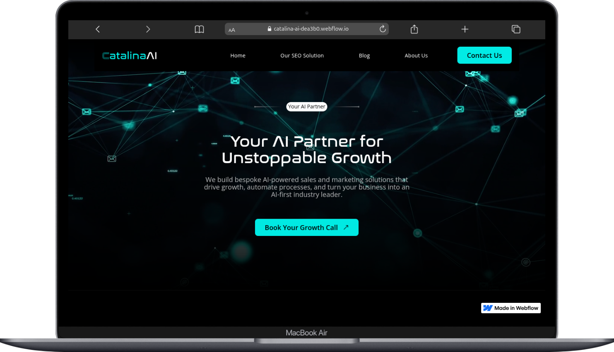

# Catalina AI – Client Project (Home, Blog & Blog Details Pages)

## 📌 Project Overview
This repository contains the **Catalina AI client project**, developed in **Webflow**.  
The scope of work covered three main pages:  
- **Home Page**  
- **Blog Page**  
- **Blog Details Page**  

The project emphasizes responsive design, clean CMS integration, and a seamless user experience across all pages.  

---

## 🔗 Project Links
- **Live Link:** [Catalina AI Website](https://catalina-ai-dea3b0.webflow.io)  
- **Preview Link:** [Webflow Designer Preview](https://preview.webflow.com/preview/catalina-ai-dea3b0?utm_medium=preview_link&utm_source=designer&utm_content=catalina-ai-dea3b0&preview=12c1a9238b7ccf539a1268052e376fcc&pageId=68d0ef643eb502d9b0064033&locale=en&workflow=preview)  

---

## 📋 Requirements & Deliverables
- **Home Page**
  - Responsive layout for desktop, tablet, and mobile.  
  - Clean structure and branding consistency.  

- **Blog Page**
  - CMS-powered blog list.  
  - Easy-to-navigate layout with titles, excerpts, and links.  

- **Blog Details Page**
  - CMS integration for dynamic blog content.  
  - Fixed issue with blog post section navigation.  
  - Implemented solution for **Table of Contents navigation**:
    - Tried with **Rich Text + Table of Contents**, but had issues.  
    - Final approach: Used **unique IDs** to allow jumping to exact sections on click (suggested by Farhan Sadik).  

---

## 🛠️ Tech Stack
- **Platform:** Webflow  
- **Languages/Features:** HTML, CSS, Webflow Animations, CMS Collections  
- **Responsive Design:** Desktop, Tablet, Mobile  

---

## 👨‍💻 Assigned By
- **Team Lead:** Farhan Sadik  
