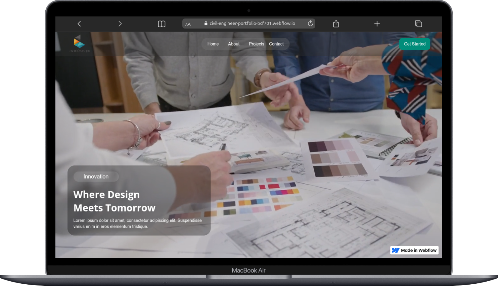

# CIVIL Engineer Portfolio Website

## 1. Project Overview

The client, a **civil engineer**, requires a **modern portfolio website** to showcase professional services, past projects, and provide easy contact options.
The website must be **WordPress-based** with a strong emphasis on **3D animations**, **clean UI/UX**, and **full-screen visuals**.

The goal is to:

* Build credibility.
* Display portfolio work effectively.
* Engage visitors with smooth **3D interactive animations**.
* Provide easy ways to contact and request consultations.

## 🔗 Project Links
- **Live Link:** [Civil Engineer Portfolio](https://civil-engineer-portfolio-bcf701.webflow.io)  
- **Preview Link:** [Webflow Designer Preview](https://preview.webflow.com/preview/civil-engineer-portfolio-bcf701?utm_medium=preview_link&utm_source=designer&utm_content=civil-engineer-portfolio-bcf701&preview=bff897ef03708d34e28b6f7179aa2bcd&workflow=preview)  

## 2. Website Structure (4 Pages)

### 🏠 Home Page

* Full-screen **background hero image/slideshow**.
* Menu overlaid on hero background.
* Civil engineering services sections.
* Smooth **3D animations** and continuous scrolling flow.
* Reviews section (integrated from Google, Yelp, HomeAdvisor, Thumbtack).
* Social media links.
* Bold white/original font headline text.

### 👤 About Us

* Professional introduction.
* Mission, values, and background.
* **Embedded YouTube video** + 2–3 client-provided photos.

### 🏗 Projects (Portfolio)

* Grid/slider layout with images + descriptions.
* Client must be able to **add/edit projects independently**.
* Strict requirement: only client-provided images/projects (no stock photos).

### 📞 Contact

* Contact form.
* Google Map embed.
* Social media + email + phone.
* **Chat button at bottom of screen** → “Request a Consultation.”
* **Calendly integration** (schedule a meeting button/link at top).

---

## 3. Design & Branding

* **Colors:** White, Orange, Blue, Gray/Black (from logo).
* **Typography:** Bold white headline text (original, attractive font).
* **Style:** Clean, minimal, professional with **continuous 3D effects**.
* **Animations:** Must start immediately on page load and flow continuously on scroll.

---

## 4. Technical Requirements

* Platform: **WordPress (Elementor Pro + Astra Pro theme provided)**.
* Responsive across **Desktop, Tablet, Mobile, iPad**.
* Portfolio management system for client self-updates.
* Integrations:

  * **Reviews:** Google, Yelp, HomeAdvisor, Thumbtack.
  * **Calendly** (meeting scheduler).
  * **Chat widget** (“Request a Consultation”).
* Hosting login & content provided by client.

---

## 5. 3D Animation Requirements

* **Continuous scroll-based 3D animations**.
* 3D elements must be integrated into the flow of the website.
* Assets:

  * Client may provide 3D models/assets.
  * If not, developer can **source/create at extra cost**.

Reference examples provided by client (TikTok videos):

* [Example 1](https://vt.tiktok.com/ZSDQ9wtan/)
* [Example 2](https://vt.tiktok.com/ZSDQ9EPUq/)
* [Example 3](https://vt.tiktok.com/ZSDQ9ouF/)
* [Another Reference](https://vt.tiktok.com/ZSDQcwJEm/)

---

## 6. Deliverables

- ✅ Fully functional **WordPress website** with 4 pages.
- ✅ Full-screen home hero with overlay menu + slideshow.
- ✅ 3D animations integrated throughout pages.
- ✅ Client review integration (Google, Yelp, HomeAdvisor, Thumbtack).
- ✅ Portfolio management (client editable).
- ✅ Calendly meeting scheduler.
- ✅ Contact form + Google Map + Consultation Chat.
- ✅ Optimized responsive design.
- ✅ Astra Pro + Elementor Pro setup.
- ✅ Video instructions for client to manage website.
- ✅ One revision round included.
- ✅ 30 days post-launch support.

---

## 7. Timeline

* **Total Duration:** 15 days.
* **Milestones (suggested):**

  * Day 1–3 → Setup WP + theme + initial design framework.
  * Day 4–7 → Home & About page with animations + video embed.
  * Day 8–10 → Projects portfolio + backend setup for client editing.
  * Day 11–12 → Contact page + integrations (reviews, map, chat, Calendly).
  * Day 13 → Final design polish (color/fonts/animation continuity).
  * Day 14 → Client review + revision round.
  * Day 15 → Final delivery + video training.

---

## 8. Pricing & Agreement

* **Initial Quote:** $1250 (discounted from $2000).
* **Negotiated Final Price:** $800 (with promise of more projects).
* **Order Accepted on Fiverr:** Confirmed.

---

## 9. Resources & References

### 🔧 Tools & Plugins

* [WordPress](https://wordpress.org/)
* [Elementor Pro](https://elementor.com/)
* [Astra Pro](https://wpastra.com/)
* [Calendly](https://calendly.com/)
* [WP Review Plugins](https://wordpress.org/plugins/tags/reviews/) (for Google/Yelp integration)
* [Tidio Chat](https://tidio.com/) or [Crisp Chat](https://crisp.chat/en/) (for consultation button)

### 🎨 Design Inspiration

* [Zen Building Custom](https://zenbulldingcustom.com) *(previous work shared)*
* [Hervon Properties](https://hervonpropertles.com) *(previous work shared)*
* TikTok animations shared by client (links above).

---

## 10. Next Steps

* Collect required assets:

  * Logo, color codes, fonts.
  * 3D assets/models (or approve extra service for sourcing).
  * Client’s text content (services, descriptions, headlines).
  * Images/videos (portfolio, about page, homepage slides).
* Get WordPress hosting login credentials.
* Start with Home Page design + animation integration.
