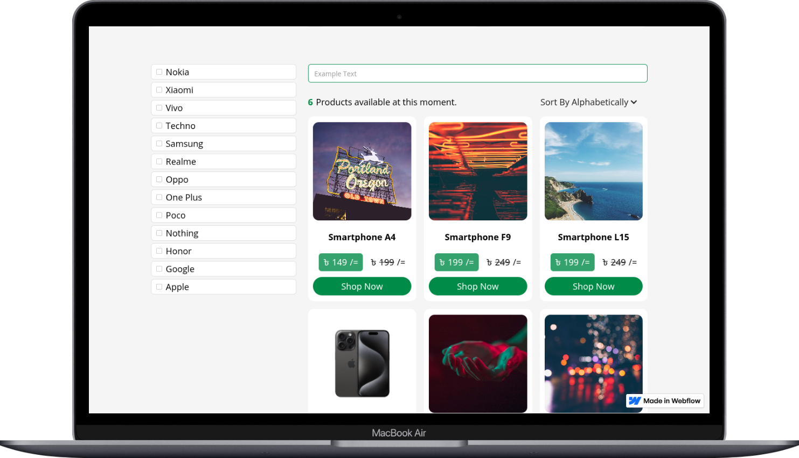

# CMS Filter (Webflow Project)

This project is a practice implementation of a CMS Filter using Finsweet on Webflow.

## 📌 Project Overview

- **Live Website:** [Visit Live Site](https://cms-filter-fabd3d.webflow.io)
- **Webflow Designer Preview:** [Preview in Webflow](https://preview.webflow.com/preview/cms-filter-fabd3d?utm_medium=preview_link&utm_source=designer&utm_content=cms-filter-fabd3d&preview=e2890ea52d9a4cf26dd26b0f62c39c06&workflow=preview)  

## 🎨 Features

- Show featured products
- Show related products
- Products search functionality
- Products filtering functionality
- Show available products
- Have pagination feature
- Show product details
- Product gallary using CMS

## 🚀 Tech & Tools

- **Development Platform:** Webflow  
- **Hosting:** Webflow Hosting  

## 📂 Project Structure

Since this is a **Webflow project**, the structure is managed within the Webflow Designer:  
- **Pages:** Home, (other pages as per design)  
- **Components:** Navbar, Footer, Section Label, Cards etc.  
- **Global Styles:** Colors

## 👤 Author

**Md. Maruf Sarker**