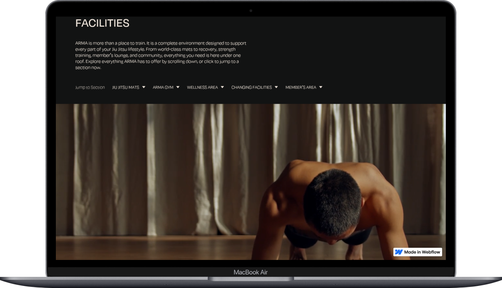

# Janeed – Client Project (Facilities Page)

## 📌 Project Overview
This repository contains the **Facilities Page** development for the Janeed client project.  
The page is built in **Webflow** and focuses on creating a user-friendly, responsive, and accessible facilities section that aligns with the client’s branding and design requirements.

---

## 🔗 Project Links
- **Live Link:** [Janeed Facilities Page](https://janeed-f1dc54.webflow.io)  
- **Preview Link:** [Webflow Designer Preview](https://preview.webflow.com/preview/janeed-f1dc54?utm_medium=preview_link&utm_source=designer&utm_content=janeed-f1dc54&preview=3badb45f65ed0171ee7f983708dec68a&workflow=preview)

---

## 📋 Requirements & Deliverables
- **Facilities Page Development**
  - Build and structure the facilities section.  
  - Ensure content matches client specifications.  

- **Webflow Implementation**
  - Use Webflow Designer with clean and reusable classes.  
  - Create responsive layouts (desktop, tablet, mobile).  

- **UI/UX Considerations**
  - Smooth animations and transitions.  
  - Consistent typography, spacing, and alignment.  

- **Quality Assurance**
  - Cross-browser compatibility.  
  - SEO-friendly structure (headings, alt tags, metadata).  
  - Accessibility compliance (contrast, screen readers).  

- **Final Deliverables**
  - Fully working Facilities Page.  
  - Live and preview links shared with the client/team lead.  
  - Documentation and handoff details.  

---

## 🛠️ Tech Stack
- **Platform:** Webflow  
- **Languages/Features:** HTML, CSS, Webflow Animations  
- **Responsive Design:** Desktop, Tablet, Mobile  

---

## 👨‍💻 Assigned By
- **Team Lead:** Kibria  

---

## 📌 Notes
This project is a **client-facing Webflow build**. The Facilities Page must be fully optimized for performance, accessibility, and SEO, ensuring a smooth user experience across devices and browsers.
