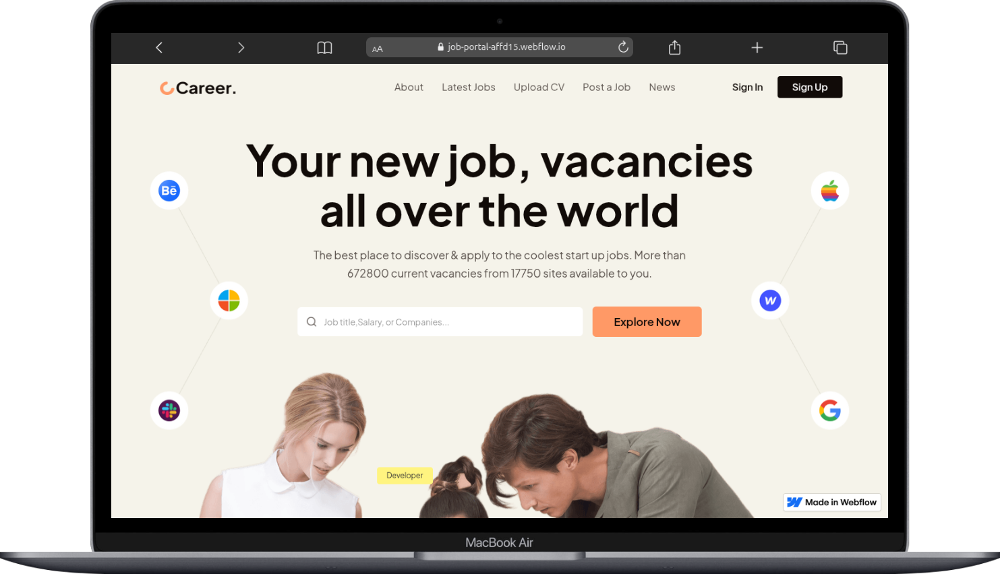

# Job Portal Website (Webflow Project)

This project is a Webflow-based implementation of the **Job Portal Website** design concept.  
The design was originally created in Figma and later cloned and built into a fully responsive Webflow site.  

## 🔗 Project Links

- **Live Link:** [Job Portal Website](https://job-portal-affd15.webflow.io)  
- **Preview Link:** [Webflow Designer Preview](https://preview.webflow.com/preview/job-portal-affd15?utm_medium=preview_link&utm_source=designer&utm_content=job-portal-affd15&preview=02ff80a2a00097c879f96775b41b1769&workflow=preview)  

## 📜 License
This project was built for **educational and portfolio purposes**.  
Please check the original design licensing before commercial use.  
