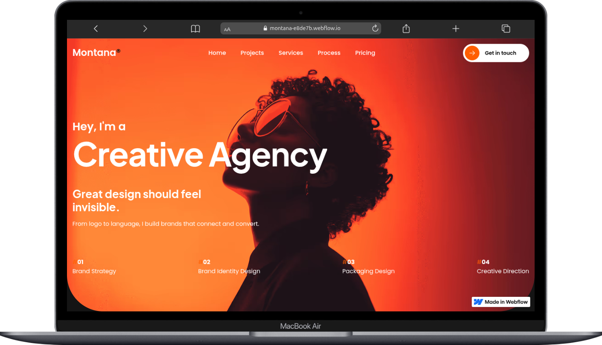

# **Montana X – Portfolio & Agency Website Template (Webflow Clone)**

A bold and modern Webflow website designed for creatives, studios, and agencies who want a high-impact portfolio experience. This repository contains the fully cloned and customized version of the **Montana X** template.

## 🚀 **Live Project**

* **Live Site:** [https://montana-e8de7b.webflow.io](https://montana-e8de7b.webflow.io)
* **Designer Preview:**
  [https://preview.webflow.com/preview/montana-e8de7b?utm_medium=preview_link&utm_source=designer&utm_content=montana-e8de7b&preview=4f4bc17148bd693deee8e27f95bd40cf&workflow=preview](https://preview.webflow.com/preview/montana-e8de7b?utm_medium=preview_link&utm_source=designer&utm_content=montana-e8de7b&preview=4f4bc17148bd693deee8e27f95bd40cf&workflow=preview)
* **Original Template:**
  [https://webflow.com/templates/html/montana-x-website-template](https://webflow.com/templates/html/montana-x-website-template)

## 🎨 **About Montana X**

**Montana X** is a sleek, modern, and visually striking Webflow template built for designers, freelancers, agencies, and creative studios.
It emphasizes clean layout structure, strong typography, dynamic visuals, and smooth interactions to help you showcase your work professionally and effectively.

This clone maintains the core style and functionality of the original template while allowing full customization for personal or client use.

## ✨ **Key Features**

* **Bold, modern aesthetic** with premium visual direction
* **Fully responsive** design that adapts beautifully to all screen sizes
* **Smooth animations & micro-interactions** crafted in Webflow
* **CMS-ready** for case studies, blog posts, and dynamic content
* **Fast performance** and SEO-friendly structure
* **No-code customization** — everything editable in Webflow
* **Global Style Guide** for consistent typography, color, and spacing
* **Reusable components** (Symbols / Layout Blocks) for quick building
* **Retina-ready** assets and HiDPI support

When using the project directly in Webflow, all pages, components, CMS collections, and interactions are managed through the Webflow Designer.
