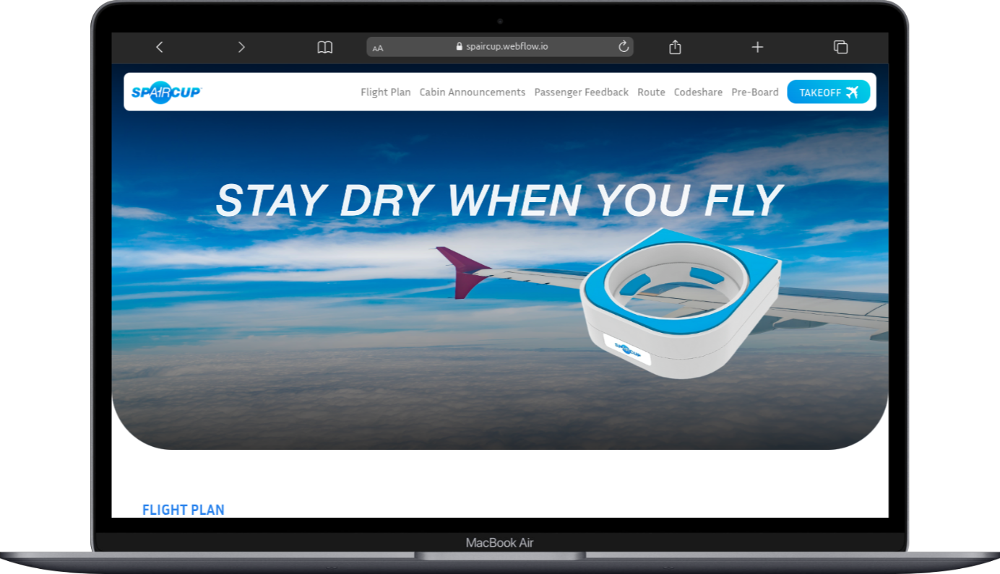

# ✈️ SPAIRCUP — Zapier Integration Automation

**Project Overview:**
SPAIRCUP™ is an innovative aviation accessory brand that enhances in-flight comfort and convenience through smart product design. The website showcases its product, passenger testimonials, and airline partnership opportunities.

This project involved integrating **Zapier automation** to streamline form submissions into Google Spreadsheets, ensuring efficient data management and reducing manual work.

---

## 🌐 Live Website

**[SPAIRCUP →](https://spaircup.webflow.io)**

---

## 🧩 My Contribution

I contributed to the **functional integration** part of the project, focusing on automating data workflows through **Zapier**.
The frontend and design portions were handled by **Md Biddut Hosen**.

---

## ⚙️ Implemented Automations

### 1️⃣ Contact Us Form

* Trigger: User submits the **Contact Us** form
* Action: Automatically logs submission details (Name, Email, Message) into a connected **Google Spreadsheet**
* Purpose: Centralized management of contact inquiries

### 2️⃣ Subscribe Newsletter Form

* Trigger: User subscribes via the **Newsletter Signup** form
* Action: Subscriber’s email is added to a **Google Spreadsheet** list
* Purpose: Build and maintain an organized email subscriber list

### 3️⃣ Feedback Form

* Trigger: User submits feedback via the **Passenger Feedback** form
* Action: Saves feedback details into a separate **Google Spreadsheet**
* Purpose: Streamline feedback collection for analysis and follow-up

---

## 🧠 Tools & Technologies

* **Zapier** — for workflow automation
* **Google Sheets** — for storing and organizing form data
* **Website Platform:** Custom-developed (handled by other contributors)

---

## 👥 Contributors

* **Md. Maruf Sarker** — Zapier Integration, Functional Automation
* **Md. Biddut Hosen** — Frontend Design & Development

---

## 📨 Contact

For inquiries related to the automation or integration:
**Md. Maruf** — https://maruf.vercel.app
