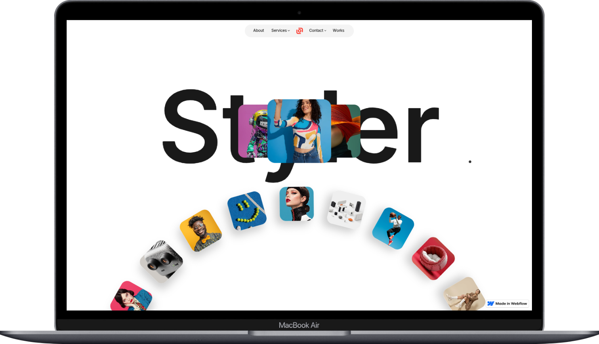

# 🎨 Styler – Webflow Portfolio & Agency Website (Clone Version)

This is a **custom Webflow project** built using the **[Styler Webflow Template](https://webflow.com/templates/html/styler-website-template)** by *Yves Adrales*.
The CMS portion of the template has been **intentionally excluded**, focusing on the **static portfolio home page** to create a sleek, high-performance website.

## 🌐 Live Project Links

* 🖥️ **Live Site:** [https://styler-437190.webflow.io](https://styler-437190.webflow.io)
* 🎨 **Webflow Preview:** [Preview in Designer](https://preview.webflow.com/preview/styler-437190?utm_medium=preview_link&utm_source=designer&utm_content=styler-437190&preview=daf0089ad24517ff2f70811f527343d5&workflow=preview)
* 🧩 **Original Template:** [Styler Template on Webflow Marketplace](https://webflow.com/templates/html/styler-website-template)

## 📖 Project Overview

**Styler** is a premium **Portfolio & Agency** Webflow template powered by **GSAP animations** and **responsive layouts**.
This clone replicates the home page from the original template—excluding CMS collections and e-commerce functionality—making it a **lightweight, fast-loading** version suitable for **personal portfolios** and **agency showcases**.

> ⚠️ *All CMS, Blog, and E-commerce-related pages have been removed for this version.*

## ✨ Key Features

| Feature                           | Description                                                              |
| --------------------------------- | ------------------------------------------------------------------------ |
| 🎯 **Modern & Minimal Aesthetic** | Clean typography and spacious layouts for professional presentation.     |
| ⚡ **Smooth GSAP Animations**      | Scroll, hover, and load animations for an immersive browsing experience. |
| 📱 **Responsive Design**          | Fully optimized for desktop, tablet, and mobile devices.                 |
| 💡 **Easy to Customize**          | Modify colors, typography, and components directly in Webflow Designer.  |
| 🚀 **Fast Performance**           | Optimized assets and lazy-loading for better loading times.              |
| 🔍 **SEO Optimized**              | Semantic HTML structure and image alt text for better search visibility. |
| 🧭 **Cross-Browser Compatible**   | Tested on Chrome, Safari, Firefox, and Edge.                             |
| 🧱 **CMS-Free Version**           | Lightweight static build without collection dependencies.                |

## 🛠️ Built With

| Tool / Platform                             | Purpose                                        |
| ------------------------------------------- | ---------------------------------------------- |
| 🕸️ **Webflow Designer**                    | Visual website builder                         |
| 🎞️ **GSAP (GreenSock Animation Platform)** | Animation and transition effects               |
| 🧰 **Webflow Interactions**                 | Page transitions, scroll effects               |
| 🌐 **Webflow Hosting**                      | Fast, secure, and globally distributed hosting |
| 🖼️ **Google Fonts**                        | Typography styling                             |

## 🧾 Customization Guide

1. Open the project in **[Webflow Designer](https://webflow.com/dashboard)**.
2. Go to the **Style Guide** page to adjust:

   * Colors
   * Fonts
   * Spacing and grid system
3. Replace images and text via **Navigator > Sections**.
4. Publish directly from Webflow or export code for self-hosting.

## 📦 Deployment

The project is currently **hosted on Webflow** at:
🔗 [https://styler-437190.webflow.io](https://styler-437190.webflow.io)

To deploy your own:

1. Duplicate the project in your Webflow workspace.
2. Customize branding and replace content.
3. Publish to your custom domain via Webflow Hosting.

## 🧑‍🎨 Credits

| Role                             | Contributor                                                                      |
| -------------------------------- | -------------------------------------------------------------------------------- |
| 🧩 **Original Template**         | [Styler – by Yves Adrales](https://webflow.com/templates/designers/yves-adrales) |
| 👨‍💻 **Cloned & Customized By** | [Md. Maruf Sarker](https://github.com/maruf-pfc)                                                                      |
| 🌍 **Platform**                  | [Webflow](https://webflow.com)                                                   |

## 📜 License

This project is based on a **paid Webflow template**.
It may be used for **personal, educational, or portfolio purposes only**.
For commercial projects, please **purchase the original license** from the [Webflow Marketplace](https://webflow.com/templates/html/styler-website-template).

## 🌟 Showcase

If you’ve customized this template, rebuilt animations, or added your own branding —
feel free to showcase it and inspire others! ✨
